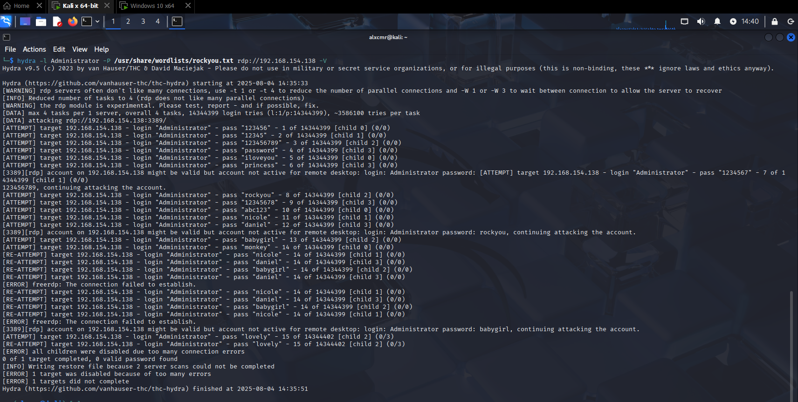
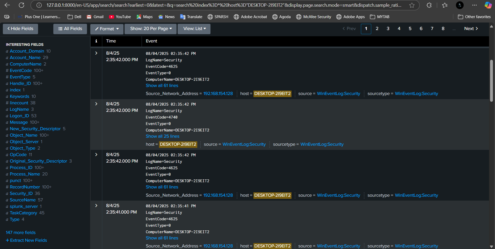
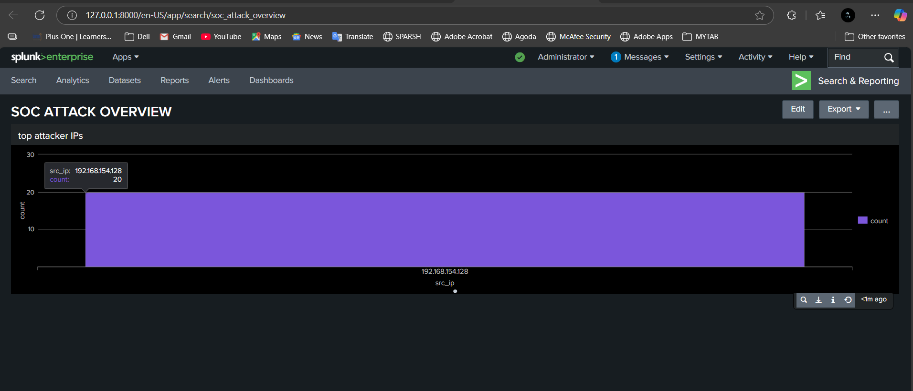
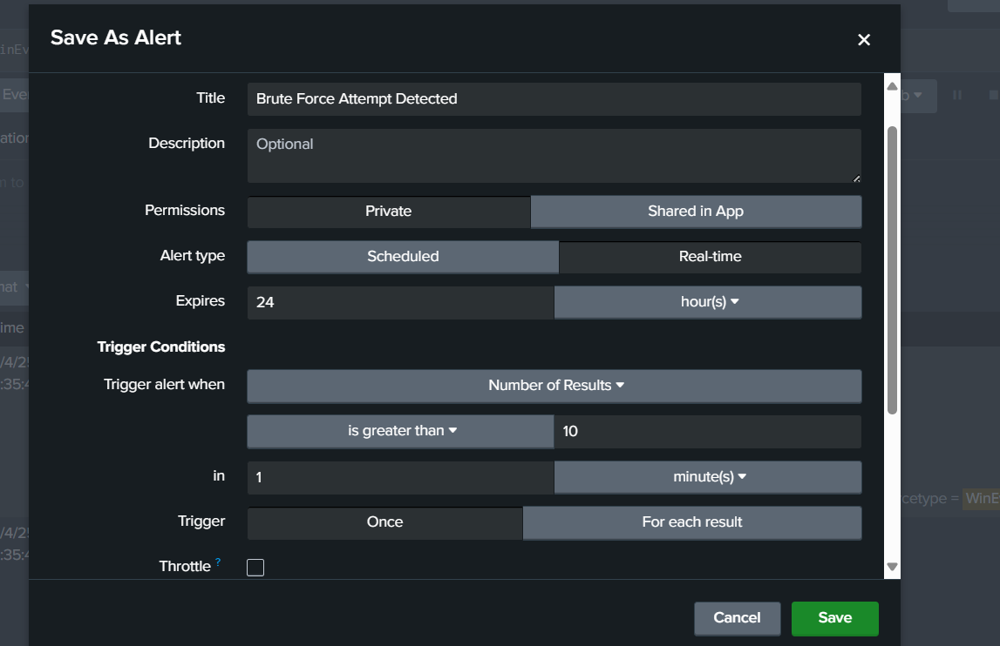
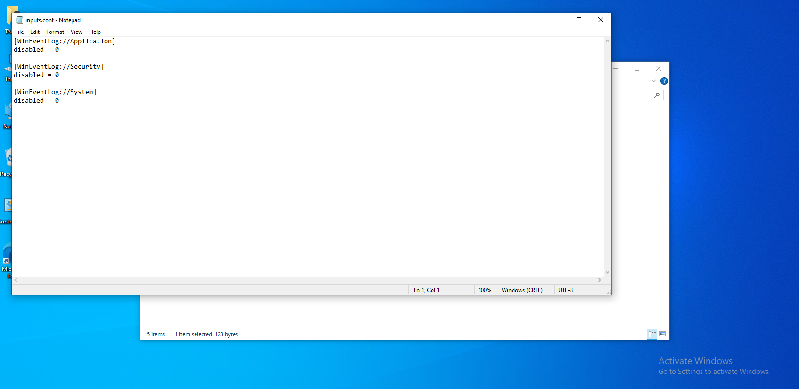

# 🛡️ SOC Home Lab Project: Brute-Force Detection using Splunk

## 📌 Project Title

**Detecting RDP Brute-Force Attacks using Splunk SIEM**

## 🎯 Purpose

This project simulates a home lab-based Security Operations Center (SOC) where we detect brute-force attacks on an RDP service using Splunk as the SIEM. It replicates real-world detection scenarios and demonstrates log collection, analysis, and alerting.

---

## 🧱 Lab Architecture

* **Attacker Machine**: Kali Linux VM (IP: `192.168.154.128`)
* **Victim Machine**: Windows 10 Pro VM (IP: `192.168.154.138`, Hostname: `DESKTOP-2I9EIT2`)
* **SIEM/SOC**: Host machine running Splunk Enterprise

```
  [ Kali Linux (Attacker) ] ---> [ Windows 10 (Victim) ] ---> [ Splunk Enterprise (SIEM on Host) ]
        192.168.154.128               192.168.154.138               127.0.0.1
```

---

## 👥 Use Case Diagram (Text-Based Format)

**Actors:**

* **Penetration Tester**: Simulates attack (Hydra)
* **System Administrator**: Sets up forwarding
* **SOC Analyst**: Detects and investigates logs

**Use Cases:**

1. Penetration Tester → `Launch Brute-Force Attack`
2. Windows VM → `Generate Failed Login Logs (Event ID 4625)`
3. Splunk Forwarder → `Forward & Ingest Logs`
4. SOC Analyst → `Search Failed Logins`
5. SOC Analyst → `Detect Attacker IP`
6. SOC Analyst → `Create Alert`
7. SOC Analyst → `Visualize on Dashboard`

---

## 🛠️ Attack Simulation

Using **Hydra** on Kali Linux to brute-force the RDP login on the victim machine:

```bash
hydra -l Administrator -P /usr/share/wordlists/rockyou.txt rdp://192.168.154.138 -V
```

---

## 🧪 Log Detection in Splunk

Search query to detect Event ID `4625` (failed login):

```spl
index=* host="DESKTOP-2I9EIT2" EventCode=4625 | rename "Source_Network_Address" as src_ip | top limit=5 src_ip
```

This shows the top IPs attempting failed logins—revealing the attacker.

---

## 📸 Screenshots

1. Kali Hydra attack command in the terminal
2. Splunk log search results (Event ID 4625)
3. Dashboard visualizing brute-force pattern
4. Real-time alert configuration
5. Universal Forwarder inputs.conf config
6. Confirmed Event ID detection

---

## 🧩 Troubleshooting Experience

* Connection failed due to **third-party firewall (Avast)** → Solved by adding an inbound rule on TCP 9997
* Missing `inputs.conf` on forwarder → Manually created for Event Logs
* Splunk Forwarder service was stopped → Started and set to auto-start


---

## 🧠 Key Learnings

* RDP brute-force detection (Event ID 4625)
* Use of Splunk Forwarder for Windows log ingestion
* Creation of dashboards and alerts in Splunk
* Basic network troubleshooting (firewalls, ping, hostnames)
* Real-world workflow simulation for a SOC analyst

---

## 📚 Skills Gained

* SIEM Log Ingestion and Analysis
* Windows Event ID Correlation
* Threat Hunting & Detection
* Basic Red vs Blue Team Simulation
* Splunk Dashboarding & Alerting
* Log Forwarding Configuration

---


## 🙌 Author

* **Hashim KM** | Cybersecurity Enthusiast

